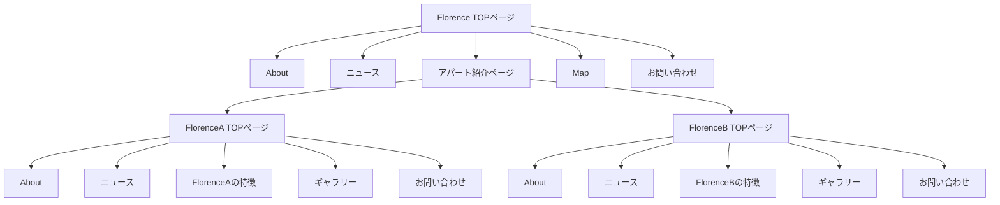

# Florence

## 概要

Florence は実家の両親が経営している女子学生専用アパートです。

本リポジトリは、Florence の情報をまとめた Web サイトになります。

また、WordPress テンプレートにしています。

## 背景

近年は入居者が減っている傾向があり、入居者を増やしたいという課題を抱えておりました。

現状 Florence の Web サイトは存在せず、インターネットから情報を調べることができません。

入居者のターゲットが学生ということもあり、インターネットで情報を公開することで入居者の増加が期待できると考え、本サイトを作成することにしました。

## 機能

### お知らせ投稿機能

WordPress の投稿ページから更新が可能です。

### Gallery の画像をモーダル表示

lightgallery というプラグインを使用し、作成しました。

## ターゲット

- 群馬大学医学部に入学する予定の女子学生
- 10 代〜20 代

# 資料

## カンプ

https://www.figma.com/file/6sMVReAEelo3D6Hd3LTYiq/%E7%84%A1%E9%A1%8C?node-id=77%3A976&t=Jv36iGjR6JLGNOOO-1

## サイトマップ

