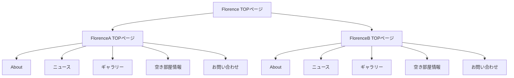

# Florence

## 背景
### ・なぜそれをやるのか？
Florenceは実家の両親が経営している学生専用アパートです。
現状はWebサイトが無く、Webからもアパートの情報がわかるようにし、多くのユーザーに認知されたいと考えたためです。
### ・このIssueで何を成し遂げたいのか？
サイト全体の概要を明白にし、わかりやすく伝えるため制作いたしました。

## ゴールインパクト
### ・何をもってこのIssueを完了とするか？
Webサイトを完成させ、リリースをすることです。
### ・誰の課題をどうすることで解消できるか？
入居者が年々減っているという課題を、このWebサイトを制作することで解消を図りたいです。

## 期限
8月23日から制作開始し、9月30日までに完成予定です。

## 参考
https://6lok.jp/vacancies/
http://www.nishino-koumuten.info/special/
https://daiwajyutaku.com/

## サイトマップ

