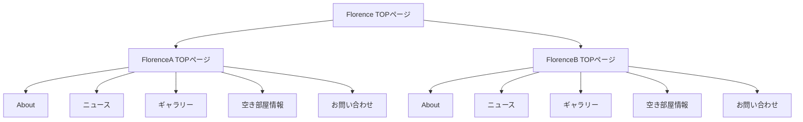

```mermaid
  graph TD;
  A[FlorenceA TOPページ]
  B[About]
  C[ニュース]
  D[ギャラリー]
  E[空き部屋情報]
  F[お問い合わせ]

  G[FlorenceB TOPページ]
  H[About]
  I[ニュース]
  J[ギャラリー]
  K[空き部屋情報]
  L[お問い合わせ]

  M[Florence TOPページ]

      A-->B;
      A-->C;
      A-->D;
      A-->E;
      A-->F;
      
      G-->H;
      G-->I;
      G-->J;
      G-->K;
      G-->L;

      M-->A;
      M-->G;
```